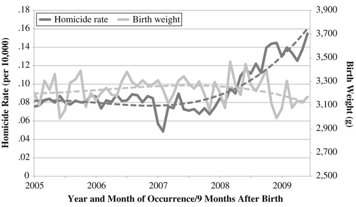

```{r setup, include=FALSE}
knitr::opts_chunk$set(
  echo    = FALSE,  # do not show code
  message = FALSE,  # suppress messages
  warning = FALSE   # suppress warnings
)

library(httr2)
library(jsonlite)
library(dplyr)
library(tidyr)
library(lubridate)
library(sf)
library(ggplot2)
library(rnaturalearth)
library(rnaturalearthdata)
library(knitr)
library(viridis)
```

# Introduction  

Violence and insecurity remain among the most pressing humanitarian challenges of our time. Globally, conflict not only causes direct harm through displacement and casualties but also undermines essential health services and erodes community well-being. Within this context, women and infants are often among the most vulnerable groups, as disruptions to antenatal care, safe deliveries, and postnatal support can lead to preventable mortality and long-term health impacts.

```{r acled-2024-data, message=FALSE, warning=FALSE}
# --------------------------
# Local cache configuration
# --------------------------
dir.create("data", showWarnings = FALSE)
cache_raw   <- "data/acled_mexico_2024_raw.rds"      # all event types
cache_violent <- "data/acled_mexico_2024_violent.rds" # filtered subset (optional)
max_age_days <- 3     # refresh window; set to Inf to never auto-refresh
force_refresh <- FALSE # set TRUE to force API pull even if cache exists

is_stale <- function(path, max_days) {
  if (!file.exists(path)) return(TRUE)
  age_days <- as.numeric(difftime(Sys.time(), file.info(path)$mtime, units = "days"))
  isTRUE(age_days > max_days)
}

need_api <- force_refresh || is_stale(cache_raw, max_age_days)

if (need_api) {
  message("Fetching ACLED 2024 from API...")

  # ---- Auth: ACLED OAuth (from env vars) ----
  username <- Sys.getenv("ACLED_USER")
  password <- Sys.getenv("ACLED_PASS")
  stopifnot(nzchar(username), nzchar(password))

  tok_resp <- request("https://acleddata.com/oauth/token") |>
    req_body_form(
      grant_type = "password",
      client_id  = "acled",
      username   = username,
      password   = password
    ) |>
    req_perform()

  tok <- resp_body_json(tok_resp, simplifyVector = TRUE)
  access_token <- tok$access_token
  stopifnot(nzchar(access_token))

  # ---- Helper: ACLED read with bearer token + pagination ----
  acled_get <- function(params = list(), page = 1, limit = 5000) {
    request("https://acleddata.com/api/acled/read") |>
      req_headers(Authorization = paste("Bearer", access_token)) |>
      req_url_query(`_format` = "json", page = page, limit = limit, !!!params) |>
      req_perform() |>
      resp_body_json(simplifyVector = TRUE)
  }

  acled_fetch_paged <- function(params = list(), page_size = 5000, max_pages = 200) {
    out <- vector("list", max_pages)
    for (p in seq_len(max_pages)) {
      dat <- acled_get(params, page = p, limit = page_size)$data
      if (is.null(dat) || length(dat) == 0) { out <- out[seq_len(p-1)]; break }
      out[[p]] <- tibble::as_tibble(dat)
    }
    bind_rows(out)
  }

  # ---- Pull Mexico 2024 ----
  params_2024 <- list(
    country = "Mexico",
    event_date = "2024-01-01|2024-12-31",
    event_date_where = "BETWEEN",
    fields = paste(c(
      "event_id_cnty","event_date","year","disorder_type",
      "event_type","sub_event_type","country","admin1","admin2",
      "latitude","longitude","fatalities"
    ), collapse="|")
  )

  mx2024 <- acled_fetch_paged(params_2024) |>
    mutate(event_date = ymd(event_date), year = as.integer(year))

  saveRDS(mx2024, cache_raw)

} else {
  message("Using cached ACLED 2024 data: ", cache_raw)
  mx2024 <- readRDS(cache_raw)
}

# ---- Define and apply "violent events" filter ----
violent_event_types <- c(
  "Violence against civilians",
  "Battles",
  "Explosions/Remote violence"
)

mx2024_violent <- mx2024 %>%
  filter(event_type %in% violent_event_types)

# (Optional) save filtered too, if you want downstream chunks to load it directly
saveRDS(mx2024_violent, cache_violent)

# ---- Totals (all vs. violent) ----
total_all_2024     <- nrow(mx2024)
total_violent_2024 <- nrow(mx2024_violent)
```

Mexico represents a particularly important case. Over the past three decades, the country has achieved notable progress in strengthening its health system and reducing maternal mortality[^1]. At the same time, it continues to face a severe and persistent burden of armed violence. In 2024 alone, the Armed Conflict Location & Event Data Project (ACLED) recorded over 5,000 violent events in Mexico, ranging from armed clashes to targeted attacks against civilians[^2]. The distribution of these incidents is highly uneven across the country: as shown in Table 1 and Figure 1, states such as Nuevo León, Guanajuato, and Michoacán rank among the most heavily affected. In these environments, women face barriers to care as clinics close due to insecurity, roads become unsafe for travel, and health workers are displaced.

```{r table}
# ---- Table: top states by violent events ----
state_counts_2024 <- mx2024_violent %>%
  count(admin1, name = "events_2024") %>%
  arrange(desc(events_2024)) %>%
  mutate(rank = row_number())

kable(
  state_counts_2024 %>% slice_head(n = 10),
  col.names = c("State (ADM1)", "Violent events (2024)", "Rank"),
  align = c("l","r","r"),
  caption = "Top 10 Mexican states by violent events recorded by ACLED, 2024."
)
```

```{r acled-2024-violent-map, message=FALSE, warning=FALSE, fig.cap="Violent events recorded by ACLED in Mexico, 2024, aggregated at the state (ADM1) level.", fig.width=7, fig.height=5, out.width="80%", fig.align='center'}
mx_admin1 <- rnaturalearth::ne_states(country = "Mexico", returnclass = "sf") %>%
  st_make_valid() %>%
  dplyr::select(name, geometry)

# Crosswalk from ACLED admin1 names to Natural Earth `name`
acled_to_ne <- c(
  "Ciudad de Mexico"                 = "Distrito Federal",
  "Coahuila de Zaragoza"             = "Coahuila",
  "Mexico"                           = "México",
  "Michoacan de Ocampo"              = "Michoacán",
  "Nuevo Leon"                       = "Nuevo León",
  "Queretaro"                        = "Querétaro",
  "San Luis Potosi"                  = "San Luis Potosí",
  "Veracruz de Ignacio de la Llave"  = "Veracruz",
  "Yucatan"                          = "Yucatán"
)

# Apply crosswalk & join to geometries
state_counts_2024_fixed <- state_counts_2024 %>%
  dplyr::mutate(admin1_ne = dplyr::recode(admin1, !!!acled_to_ne, .default = admin1))

mx_map <- mx_admin1 %>%
  dplyr::left_join(state_counts_2024_fixed %>% dplyr::select(admin1_ne, events_2024),
                   by = c("name" = "admin1_ne")) %>%
  dplyr::mutate(events_2024 = tidyr::replace_na(events_2024, 0L))

# Compute a padded bounding box to avoid clipping
bb <- sf::st_bbox(mx_map)
pad_x <- as.numeric(bb["xmax"] - bb["xmin"]) * 0.02
pad_y <- as.numeric(bb["ymax"] - bb["ymin"]) * 0.02
xlims <- c(bb["xmin"] - pad_x, bb["xmax"] + pad_x)
ylims <- c(bb["ymin"] - pad_y, bb["ymax"] + pad_y)

# Plot (no internal title/subtitle/caption; those live in fig.cap)
ggplot(mx_map) +
  geom_sf(aes(fill = events_2024), color = "white", size = 0.2) +
  scale_fill_viridis_c(option = "C", name = "Violent events (2024)") +
  coord_sf(xlim = xlims, ylim = ylims, expand = FALSE, datum = NA) +
  theme_minimal(base_family = "serif", base_size = 12) +
  theme(
    axis.text = element_blank(),
    axis.ticks = element_blank(),
    axis.title = element_blank(),
    panel.grid = element_blank(),
    plot.margin = unit(c(5, 5, 5, 5), "pt"),  # small outer margin
    legend.position = "right"
  )
```

The consequences for maternal and infant health are increasingly evident. While national maternal mortality indicators show long-term improvement, localized studies point to significant setbacks in violent areas. For example, Brown (2018) demonstrated that rising homicide rates were associated with significantly lower newborn birth weights, highlighting how chronic insecurity degrades prenatal and infant outcomes[^3]. These findings illustrate that maternal and infant health in Mexico is acutely sensitive to violence, even when national averages suggest progress (Figure 2).

```{r villarreal-bw, echo=FALSE, fig.cap="Relationship between homicide rate and newborn birth weight in Mexico. Adapted from Brown (2018).", out.width="50%", fig.align='center', fig.pos='H'}

```

Within this landscape, Catholic Relief Services (CRS) has a long-standing presence in Mexico, working with local partners to address systemic injustice, migration, and the needs of vulnerable populations[^4]. CRS’s strategy emphasizes collaboration with Caritas Mexico, the national Catholic social service organization[^5]. Caritas operates a wide range of humanitarian services, including *brigadas de salud* — mobile health brigades that deliver care to marginalized communities. These brigades provide an accessible and flexible platform for delivering maternal and infant health services in areas where violence makes regular clinic visits difficult.

This project proposes to develop a real-time dashboard that integrates conflict event data with maternal and infant health vulnerability indicators in order to guide deployment of *brigadas de salud materna* — brigades with a targeted focus on maternal and infant outcomes. The vision is not to send brigades directly into zones of ongoing armed clashes, but rather to anticipate where violence is disrupting access and to position services in nearby, safer municipalities that displaced or diverted patients are most likely to reach. By identifying where conflict most threatens maternal and infant care, the dashboard will allow CRS and Caritas to allocate resources more strategically, ensuring that brigades are deployed where they can have the greatest humanitarian impact. 

# Product Description  

The proposed dashboard will update daily, drawing on ACLED conflict data combined with indicators of maternal and infant vulnerability. These include measures of poverty and marginalization, health facility density and average travel distances to obstetric care, availability of skilled birth attendants, recent displacement trends, and the share of indigenous populations who may face linguistic or cultural barriers to accessing services. Where available, maternal and infant health indicators — such as antenatal care coverage, facility-based delivery rates, and infant birth weights — will be incorporated to sharpen the risk profile. Integrating these dimensions will allow the tool to flag areas where conflict shocks intersect with weak health system capacity and high vulnerability, helping CRS and Caritas anticipate where brigadas de salud materna are most urgently needed. The product will provide:  

- A national map of conflict-affected areas with maternal and infant health vulnerabilities highlighted.  
- A ranked list of municipalities most in need of brigadas de salud materna.  
- Predictive modeling to identify states and municipalities where risks are expected to increase in the coming month.  

The dashboard is designed for operational clarity. If CRS and Caritas have six brigadas available, they will be deployed to the six highest-priority municipalities on the ranked list. This ensures a transparent link between analysis and action.  

# Target Users and Rationale  

- **CRS Senior Executives (Global Level):** Require clear visibility into the scale and trajectory of violence and maternal/infant health risks within Mexico. Their concern is ensuring that Mexico receives an appropriate share of organizational resources given the severity of needs on the ground.  

- **CRS Country Leadership (Mexico):** Need disaggregated insights at the state and municipal level to guide funding requests, prioritize high-risk areas, and align national strategies with global directives.  

- **Caritas Regional Chapters (Diocesan Level):** Manage brigada operations and therefore need a dashboard with localized data to coordinate deployments, balance coverage across communities, and adapt to shifting security conditions.  

This three-tiered design ensures that global executives can make informed resource decisions, national leadership can target strategies effectively, and regional Caritas chapters can translate strategy into timely and context-specific action.

# Descriptive Analysis Questions  

The dashboard will address the following questions:  

- Where are current conflict events occurring in Mexico, and how do they overlap with maternal and infant health vulnerabilities?  
- Which municipalities are most at risk of maternal and infant health service disruption due to conflict?  
- How are these risks distributed across states, and where are clusters of municipalities facing the most acute needs?  
- What are the recent trends in conflict and maternal/infant health risks over time?  

# Predictive Analysis Question  

- *Which states (ADM1) are most likely to experience rising violence and maternal/infant health risks in the next month, and how should CRS and Caritas allocate limited brigadas de salud materna among high-risk municipalities within those states?*  

# Conclusion  

Armed conflict in Mexico has far-reaching implications beyond direct casualties, profoundly affecting maternal and infant health. While national indicators suggest steady progress, localized disruptions highlight the need for tools that can reveal hidden vulnerabilities and guide timely humanitarian response. CRS and Caritas are uniquely positioned to meet these needs through their established *brigadas de salud* model.  

By developing a real-time dashboard that integrates conflict data with maternal and infant health indicators, CRS can ensure that brigadas de salud materna are deployed with maximum impact. This project will strengthen our ability to protect women and infants in Mexico’s most vulnerable communities, aligning analytical rigor with CRS’s humanitarian mission.  

[^1]: World Health Organization, UNICEF, UNFPA, World Bank Group, & United Nations Department of Economic and Social Affairs, Population Division. (2025). *Trends in maternal mortality: 2000 to 2023*. Geneva: World Health Organization. Retrieved from https://iris.who.int/bitstream/handle/10665/381012/9789240108462-eng.pdf?sequence=1
[^2]: Armed Conflict Location & Event Data Project (ACLED). (2025). *Armed Conflict Location & Event Data (ACLED) dataset*. Accessed 20 September 2025. https://acleddata.com
[^3]: Brown, R. (2018). The Mexican Drug War and Early-Life Health: The Impact of Violent Crime on Birth Outcomes. *Demography*, 55(1), 319–340. https://doi.org/10.1007/s13524-017-0639-2
[^4]: Catholic Relief Services. (n.d.). *CRS in Mexico*. Retrieved September 18, 2025, from https://www.crs.org/where-we-work/latin-america-caribbean/mexico
[^5]: Cáritas Mexicana. (n.d.). *Pastoral de la Salud*. Retrieved September 18, 2025, from https://caritasmexicana.org/salud.php